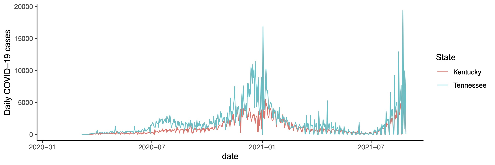

 

# Course information

|                    |                                                               |
|--------------------|---------------------------------------------------------------|
| **Instructor**     | Dr. Jeremy Van Cleve                                          |
| **E-mail**         | <jvancleve@uky.edu>                                           |
| **Phone**          | \(859\) 218-3020                                              |
| **Office**         | 216 THM                                                       |
| **Office hours**   | By appointment                                                |
|                    |                                                               |
| **Class Time**     | M 1 – 3 PM                                                    |
| **Class Location** | JSB 357                                                       |
| **Website**        | <https://github.com/vancleve/BIO621-DWVR> (github website)    |
|                    | <https://uk.instructure.com/courses/2041707> (Canvas website) |

# Course description

The last 20 years have seen the [R programming
language](https://www.r-project.org/) rise in popularity from a language
used and developed primarily by statisticians to one used and developed
by anyone interested in analyzing and visualizing data from scientists
and engineers to historians and journalists. This **two-credit** seminar
aims to provide a brief introduction (i.e., a *crash course*) to using R
for analyzing and visualizing data. As R and other scripting languages
have become more popular, so have the tools required to document,
maintain, share, and replicate analyses and visualization. These
activities constitute “literate programming” and “reproducible
research”, and we will use some of these tools (particularly
[`Quarto`](https://quarto.org/)).

Prerequisites: None.

# Student learning outcomes

1.  Execute commands in R
2.  Create [`Quarto`](https://quarto.org/) markdown documents that use
    `R` to explain and reproduce analyses
3.  Wrangle and manipulate data by slicing matrices and by using the
    `dplyr`, `tidyr`, and other `tidyverse` packages
4.  Plotting using the [`ggplot2`](http://ggplot2.org/) package
5.  Visualize multidimensional data using 2D/3D plots, networks, and
    other tools
6.  Create easily reproducible publication quality figures without
    expensive applications

# Course format

Each week will consist of a short introduction and interactive
demonstration of the concepts and tools for that week followed by a
short lab where students apply the concepts and tools. There may be
preliminary readings to do before class for some weeks (see “Topic
schedule” below and check back for updates); please make sure to do
those so that we make the most of time in class.

# Assessment

|                      |     |                                                       |
|----------------------|-----|-------------------------------------------------------|
| Attendance           | 20% | Two absences permitted without penalty                |
| Lab work             | 40% | Submitted as markdown file (`.qmd`) before next class |
|                      |     | One missing lab permitted without penalty             |
| Project Presentation | 40% | 8-10 min presentation with figures and data analysis  |
|                      |     | Data/markdown doc/slides due on date of presentation  |

The assessment portion of the course has three components.

1.  Class attendance.
2.  Completion of the lab component that we begin in class. This must be
    turned in as a markdown document. If there are datasets that are
    required for the analysis (*other than datasets provided as part of
    the lab or lecture*), these should be provided along with the
    `Quarto` markdown file (with last name `qmd`) by adding all the
    files to a single compressed `zip` file. The `qmd` or `zip` file
    should then be uploaded to the [Canvas course
    website](https://uk.instructure.com/courses/2041707).
3.  Project presentation. The last two classes will be devoted to 8-10
    minute presentations of **five** figures that present data from
    ***one or two datasets*** of your choice. The figures should be
    “publication quality” in terms of aesthetics (labeling, font size,
    colors, etc) but do not need a caption (that’s what the talk is
    for!). The markdown source code and any necessary data files must be
    submitted to the Canvas website as a `zip` file; compiling the
    markdown file (with `Quarto`) should produce the figures as they
    were presented during the lightning talk. If you want a challenge,
    you can even write your slides in markdown too!

## Tips for making sure I can run your R code.

- For every assignment, create a separate folder for each assignment and
  put the `.qmd` file and all the other necessary files (data files,
  images, etc) in that folder.
- Zip the contents of that folder (or the folder itself) and submit that
  to Canvas.
- Use *relative* directories when pointing to files. Relative
  directories begin simply the name of the file or subdirectory of the
  current directory (I use relative directories in all the course `.qmd`
  files). That is, **avoid** directories like
  `C:\Documents\student\R\stuff\stuff.jpg` and instead simply put
  `stuff.jpg` if its in the same directory as the `.qmd`.
- Make sure your analyses run without errors and your `.qmd` can be
  compiled into a `.html` file successfully by first typing
  `rm(list=ls())` into the R console and then compiling the file. This
  will start your workspace from scratch and is also a good way of
  preventing the problem where an analysis worked when you closed R but
  now doesn’t when you reopen it.

# Getting help (i.e., uh, how do I…?)

## Classmates and instructor

1.  **Please start a discussion** on the [Canvas
    website](https://uk.instructure.com/courses/2041707). This will
    allow everyone to benefit from the questions and answers posed. I
    will monitor this discussion and post replies as necessary. Please
    also post your own replies too!
2.  Instructor office hours.

## Internet

1.  Stack Overflow (<http://stackoverflow.com/>). Programming and
    developer Q&A site. Search as normal for keywords, add tags enclosed
    in square brackets, e.g. \[ggplot\] or \[git\], to restrict results
    to the library or language you want answers in.
2.  Cross Validated (<http://stats.stackexchange.com/>). A site in the
    same family as Stack Overflow. Focused on conceptual and procedural
    questions in statistics (less on implementation in R or other
    languages).
3.  Google. The oldie but the goodie.

# Useful resources

## Books

There are some recent books on data science and visualization (all
written in `RMarkdown`, which is a predecessor and alternative to
`Quarto`) that cover much of the material in the course.

- Wickham, Hadley and Grolemund, Garrett. 2017. R for Data Science.
  O’Reilly. <http://r4ds.had.co.nz/>
- Wilke, Claus O. 2018. Fundamentals of Data Visualization.
  <https://clauswilke.com/dataviz/>
- Healy, Kieran. 2018. Data Visualization: A Practical Introduction.
  <http://socviz.co/>
- Ismay, Chester and Kim, Albert Y. 2018. An Introduction to Statistical
  and Data Sciences via R. <https://moderndive.com/>
- Silge, Julia and Robinson, David. 2018. Text Mining with R: A Tidy
  Approach. <https://www.tidytextmining.com/>

If you want to become an R wizard in the style of Hadley Wickham, this
book is for you.

- Wickham, Hadley. 2019. Advanced R. <https://adv-r.hadley.nz/>

The following are some popular books on R. PDFs are available for “check
out” on the [Canvas website](https://uk.instructure.com/courses/2041707)
under “Modules: References”.

- Crawley, Michael J.. 2005. Statistics: An Introduction using R. Wiley
- Dalgaard, Peter. 2008. Introductory Statistics with R. Springer
- Murrell, Paul. 2011. R Graphics. CRC Press
- Chang, Winston. 2013. R Graphics Cookbook. O’Reilly
- Gandrud, Christopher. 2015. Reproducible Research with R and R Studio.
  CRC Press.
- Zelterman, Daniel. 2015. Applied Multivariate Statistics with R.
  Springer
- Phillips, Nathaniel. 2016. YaRrr! The Pirate’s Guide to R.
- Wickham, Hadley. 2016. ggplot2. Springer
- Wickham, Hadley and Grolemund, Garrett. 2017. R for Data Science.
  O’Reilly
- Mailund, Thomas. 2017. Beginning Data Science in R. Apress

## Internet

- RStudio Cheatsheets
  (<https://www.rstudio.com/resources/cheatsheets/>). Cheatsheets for
  working with `ggplot2`, R Markdown, and other R packages.
- `Quarto` documentation. <https://quarto.org/docs/guide/>
- FlowingData (<http://flowingdata.com/>). Articles, examples, and
  tutorials on data visualization by Nathan Yau.
- Other data visualization and wrangling courses:
  - “Visualizing Data” by Chris Adolph (UWashington):
    <http://faculty.washington.edu/cadolph/index.php?page=22>
  - “Data wrangling, exploration, and analysis with R” by Jenny Bryan
    (UBC): <http://stat545.com/>
- DataCamp interactive courses. <http://www.datacamp.com>

# Topic schedule

The following is the preliminary schedule of topics and will be adjusted
as the semester progress.

| Week | Class Dates (W) | Topic                                               | Link                                                       |
|------|-----------------|-----------------------------------------------------|------------------------------------------------------------|
| 1    | 08/22           | Intro to course and markdown, and Quarto            | [html](https://vancleve.github.io/BIO621-DWVR/week1.html)  |
| 2    | 08/29           | Intro to R: data types, flow control, and functions | [html](https://vancleve.github.io/BIO621-DWVR/week2.html)  |
|      | 09/05           | No class (Labor Day)                                |                                                            |
| 3    | 09/12           | Vectors, slicing, and map(ping)                     | [html](https://vancleve.github.io/BIO621-DWVR/week3.html)  |
| 4    | 09/19           | Getting data into R with data.frames                | [html](https://vancleve.github.io/BIO621-DWVR/week4.html)  |
| 5    | 09/26           | Tidy Data                                           | [html](https://vancleve.github.io/BIO621-DWVR/week5.html)  |
| 6    | 10/03           | Introduction to plotting and `ggplot2`              | [html](https://vancleve.github.io/BIO621-DWVR/week6.html)  |
| 7    | 10/10           | Plot types in `ggplot2`                             | [html](https://vancleve.github.io/BIO621-DWVR/week7.html)  |
|      | 10/17           | No class (JVC at international conference)          |                                                            |
|      | 10/24           | No class (Fall Break)                               |                                                            |
| 8    | 10/31           | Principles of displaying data & how to modify plots | [html](https://vancleve.github.io/BIO621-DWVR/week8.html)  |
| 9    | 11/07           | Text manipulation: regular expressions              | [html](https://vancleve.github.io/BIO621-DWVR/week9.html)  |
| 10   | 11/14           | Colors and heat maps                                | [html](https://vancleve.github.io/BIO621-DWVR/week10.html) |
| 11   | 11/21           | Visualizing lots of data                            | [html](https://vancleve.github.io/BIO621-DWVR/week11.html) |
| 12   | 11/28           | Networks                                            | [html](https://vancleve.github.io/BIO621-DWVR/week12.html) |
| 13   | 12/05           | Project Presentations                               |                                                            |

# Course policies

Please see <https://www.uky.edu/universitysenate/acadpolicy> for a full
description of UK academic policies.

## Diversity and Inclusion

Members of the course are entitled to learn from each other in an open
and welcoming environment regardless of their racial, ethnic, gender,
and sexual identities. Conduct that is not respectful of these
identities or of the national origin, religion, and political beliefs
students and instructors will not be tolerated. Please report any
concerning conduct to the instructor.

## Face Covering/Distancing Policy

- Transmission of COVID-19 is still prevalent in Kentucky. The
  instructor and students are entitled to practices that reduce
  transmission including, and not limited to, wearing a high-quality
  mask and social distancing.

- In accordance with University guidelines, these transmission reducing
  practices are optional but the instructor encourages them. If COVID-19
  is a specific risk to a student or a student has any concerns about
  classroom COVID-19 policies, please contact the instructor as soon as
  possible.

- More information about COVID-19 and UK can be found here:
  <https://coronavirus.uky.edu/>

## Excused Absences

Students need to notify the instructor of absences prior to class when
possible. Senate Rule Senate Rules 5.2.5.2.1 defines the following as
acceptable reasons for excused absences: (a) significant illness, (b)
death of a family member, (c) trips for members of student organizations
sponsored by an educational unit, trips for University classes, and
trips for participation in intercollegiate athletic events, (d) major
religious holidays, (e) interviews for graduate/professional school or
full-time employment post-graduation, and (f) other circumstances found
to fit “reasonable cause for nonattendance” by the professor.

Students anticipating an absence for a major religious holiday are
responsible for notifying the instructor in writing of anticipated
absences due to their observance of such holidays no later than the last
day in the semester to add a class. Information regarding major
religious holidays may be obtained through the Ombud (859-257-3737,
<https://www.uky.edu/ombud/religious-observances>). Students are
expected to withdraw from the class if more than 20% of the classes
scheduled for the semester are missed (excused or unexcused) per
university policy.

## Verification of Absences

Students may be asked to verify their absences in order for them to be
considered excused. Senate Rule 5.2.5.2.1 states that faculty have the
right to request appropriate verification when students claim an excused
absence due to: significant illness; death in the household, trips for
classes, trips sponsored by an educational unit and trips for
participation related to intercollegiate athletic events; and interviews
for full-time job opportunities after graduation and interviews for
graduate and professional school.

## Academic Integrity

Per university policy, students shall not plagiarize, cheat, or falsify
or misuse academic records. Students are expected to adhere to
University policy on cheating and plagiarism in all courses. The minimum
penalty for a first offense is a zero on the assignment on which the
offense occurred. If the offense is considered severe or the student has
other academic offenses on their record, more serious penalties, up to
suspension from the university may be imposed.

Plagiarism and cheating are serious breaches of academic conduct. Each
student is advised to become familiar with the various forms of academic
dishonesty as explained in the Code of Student Rights and
Responsibilities. Complete information can be found at the following
website: <https://www.uky.edu/ombud/>. A plea of ignorance is not
acceptable as a defense against the charge of academic dishonesty. It is
important that you review this information as all ideas borrowed from
others need to be properly credited.

Section 6.3 “Academic Offenses and Procedures” of the [Senate
Rules](http://www.uky.edu/universitysenate/rules-regulations) lays out
UK’s policy on academic integrity and says the following about plagarism
and

## Accommodations due to disability

In accordance with federal law, if you have a documented disability that
requires academic accommodations, please inform me as soon as possible.
In order to receive accommodations in a course, you must provide me with
a Letter of Accommodation from the Disability Resource Center (DRC).

The DRC coordinates campus disability services available to students
with disabilities. It is located on the corner of Rose Street and
Huguelet Drive in the Multidisciplinary Science Building, Suite 407. You
can reach them via phone at (859) 257-2754, via email (<drc@uky.edu>) or
visit their website (<https://www.uky.edu/DisabilityResourceCenter/>).
DRC accommodations are not retroactive and should therefore be
established with the DRC as early in the semester as is feasible.
